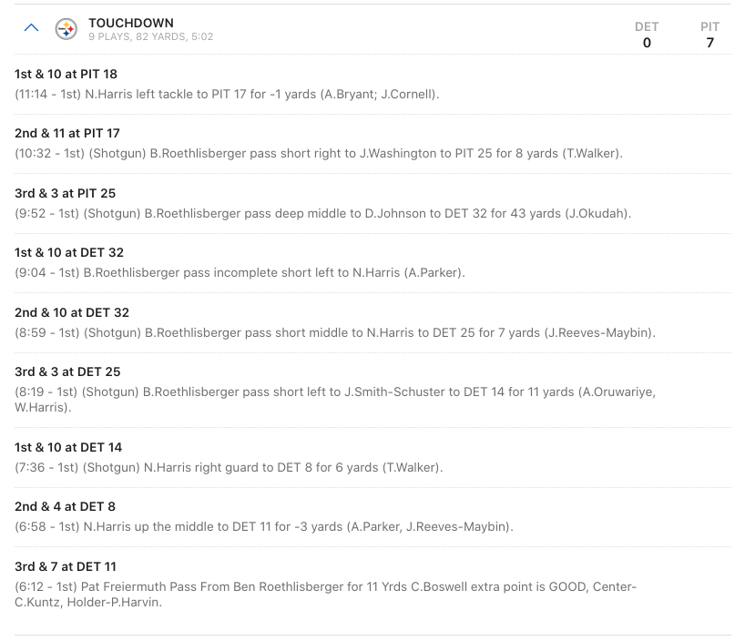

```{r setup, include = FALSE, eval = TRUE}
library(tidyverse)
library(tidymodels)
library(vip)
library(usemodels)
library(xaringan)
library(gt)

knitr::opts_chunk$set(fig.retina = 3, warning = FALSE, message = FALSE)

knitr::read_chunk("tidymodel_script.R")
```


layout: true

<!-- <div class="my-footer"><span>cmsac-tidymodels.netlify.app/</span></div> -->

<!-- this adds the link footer to all slides, depends on my-footer class in css-->

---

```{r xaringan-themer, eval = FALSE, include=FALSE, warning=FALSE}
library(xaringanthemer)
style_mono_light(
  base_color = "#374785",
  text_color = darken_color("#8E8D8A", 0.5),
  white_color = lighten_color("#C2CAD0", 0.95),
  code_inline_color = choose_dark_or_light("#E98074", "#E85A4F"),
  header_font_google = google_font("Noto Sans"),
  text_font_google   = google_font("Karla", "300", "300i"),
  code_font_google   = google_font("Fira Mono"),
  extra_css = list(".hljs-github .hjls" = list("background" = "black"),
                   ".small" = list("font-size" = "70%"),
                   ".small pre .remark-code" = list("font-size" = "75%"),
                   ".small .remark-code" = list("font-size" = "75%"),
                   ".tiny .remark-code" = list("font-size" = "50%"),
                   ".medium .remark-code" = list("font-size" = "90%")
  )
)
```

```{css, include = FALSE, eval = TRUE}
/* Extra CSS */
.hljs-github .hjls {
  background: black;
}
.small {
  font-size: 70%;
}
.small pre .remark-code {
  font-size: 75%;
}
.small .remark-code {
  font-size: 75%;
}

.tiny {
  font-size: 60%;
}
.tiny pre .remark-code {
  font-size: 60%;
}
.tiny .remark-code {
  font-size: 60%;
}

.tiny .remark-code {
  font-size: 60%;
}

.medium {
  font-size: 80%;
}
.medium pre .remark-code {
  font-size: 85%;
}
.medium .remark-code {
  font-size: 85%;
}

.remark-slide thead, .remark-slide tr:nth-child(2n) {
  background-color: white;
}

.remark-slide thead, .remark-slide tr:nth-child(2n) {
  background-color: white;
}

/* footer */

div.my-footer {
    background-color: #1a1917;
    position: absolute;
    bottom: 0px;
    left: 0px;
    height: 20px;
    width: 100%;
}

div.my-footer span {
    font-size: 10pt;
    color: #F7F8FA;
    position: absolute;
    left: 15px;
    bottom: 2px;
}

```

### What have I done?

* Bachelor's in Kinesiology (2011) - Effect of Sugar vs Sugar-Free Mouth Rinse on Performance  
* Master's in Exercise Physiology (2014) - Effect of Exercise on Circulating Brain Biomarkers  
* PhD in Neurobiology (2018) - Effect of Aging + Glutathione Deficiency on Motor and Cognitive Function    

--

### What do I do?

* RStudio, Customer Enablement Lead - Help RStudio's customers utilize Open Source data science and our Professional Products
--

* [`#TidyTuesday`](https://github.com/rfordatascience/tidytuesday/blob/master/README.md) - Weekly data analysis community project (~4,000 participants in past 3 years)  

--

* [TheMockUp.blog](https://themockup.blog/) - Explanatory blogging about `How to do Stuff` with data + `#rstats`, *mostly* with NFL data  

--

* [`espnscrapeR`](https://jthomasmock.github.io/espnscrapeR/) - collect data from ESPN's public APIs, mostly for QBR and team standings  

--

* [`gtExtras`](https://jthomasmock.github.io/gtExtras/) - User-focused wrappers extensions to the `gt` package  

---

### Focus for Today

90 Minutes (with breaks)

Binary classification:  
- Logistic Regression  
- Random Forest  

--

Slides at: [cmsac-tidymodels.netlify.app/](https://cmsac-tidymodels.netlify.app/#1)  
Source code at: [github.com/jthomasmock/nfl-workshop](https://github.com/jthomasmock/nfl-workshop)  

--

To follow along, you can read in the subsetted data with the code below:  

```{r, eval = FALSE}
raw_url <- "https://github.com/jthomasmock/nfl-workshop/blob/master/raw_plays.rds?raw=true"
raw_plays <- readRDS(url(raw_url, method = "libcurl"))
```

---

### Level-Setting

As much as I'd love to learn and teach *all* of Machine Learning/Statistics in 90 min...  

--

It's just not possible!  

--

### Goals for today

* Make you comfortable with the **syntax** and **packages** via `tidymodels` unified interface
* So when you're learning or modeling on your own, you get to focus on the **stats** rather than re-learning different APIs over and over...

--

Along the way, we'll cover minimal examples and then some more quick best practices where `tidymodels` makes it easier to do more things!  

---

# `tidymodels`

`tidymodels` is a collection of packages for modeling and machine learning using `tidyverse` principles.

## Packages
* `rsample`: efficient data splitting and resampling  
* `parsnip`: tidy, unified interface to models  
* `recipes`: tidy interface to data pre-processing tools for feature engineering  
* `workflows`: bundles your pre-processing, modeling, and post-processing  
* `tune`: helps optimize the hyperparameters and pre-processing steps  
* `yardstick`: measures the performance metrics  
* `dials`: creates and manages tuning parameters/grids  
* `broom`: converts common R statistical objects into predictable formats  
  * [`broom` available methods](https://broom.tidymodels.org/articles/available-methods.html)  

---
class: inverse, center, middle

# `tidymodels` vs `broom` *alone*

---

### `broom`

> `broom` summarizes key information about models in tidy `tibble()`s.

--

> `broom` tidies 100+ models from popular modelling packages and almost all of the model objects in the `stats` package that comes with base R. `vignette("available-methods")` lists method availability.

--

> While broom is useful for summarizing the result of a single analysis in a consistent format, it is really designed for high-throughput applications, where you must combine results from multiple analyses. 

--

I *personally* use `broom` for more classical statistics and `tidymodels` for machine learning. A more detailed summary of what `broom` is about can be found in the [`broom` docs](https://cran.r-project.org/web/packages/broom/vignettes/broom.html).

---

### `lm()` example

.pull-left[
```{r, cache=TRUE, message = FALSE, warning=FALSE}
library(tidyverse)

basic_plot <- mtcars %>% 
  ggplot(
    aes(x = disp, y = mpg)
    ) +
  geom_point() +
  geom_smooth(method = "lm") +
  theme_minimal() +
  labs(
    x = "Fuel Displacement", y = "Miles per Gallon", 
    title = "Fuel economy is related to engine size"
    )
```
]

--

.pull-right[
```{r, message = FALSE, warning=FALSE, echo = FALSE, fig.dim=c(5,5)}
basic_plot
```

]

---

### `base` example

.small[
```{r}
# fit a basic linear model
basic_lm <- lm(mpg ~ disp, data = mtcars)
```

]

--

.small[
```{r}
basic_lm
```

]

--

.small[
```{r}
summary(basic_lm)
```

]


---

### `broom` example

```{r}
broom::tidy(basic_lm)
```

--

```{r}
broom::glance(basic_lm)
```

---

#### Want more `broom`?

There's a lot more to `broom` for *tidy-ier* modeling - out of scope for today, but details at [broom.tidymodels.org](https://broom.tidymodels.org/) and [R4DS Many Models Chapter](https://r4ds.had.co.nz/many-models.html).

---
class:inverse, center, middle

# Tidy Machine Learning w/ `tidymodels`
```{r, echo = FALSE, out.width="25%"}
knitr::include_graphics("https://raw.githubusercontent.com/rstudio/hex-stickers/master/SVG/tidymodels.svg")
```

---

### Core ideas for Today

A workflow for `tidy` machine learning  

* Split the data  
* Pre-Process and Choose a Model  
* Combine into a Workflow  
* Generate Predictions and Assess Model Metrics  

---

# Goal of Machine Learning

### `r emo::ji("hammer")` construct models that

--

### `r emo::ji("target")` generate accurate predictions

--

### `r emo::ji("new")` for future, yet-to-be-seen data

--

[Feature Engineering - Max Kuhn and Kjell Johnston](http://www.feat.engineering/) and Alison Hill

---

### Classification

Showing two examples today, comparing their outcomes, and then giving you the chance to explore on your own! 

---

### The Dataset

Filtered down from the `nflfastR` datasets (~2.25 GB) to only non-penalty run and pass plays for the 2017-2019 regular seasons, and on downs 1st, 2nd or 3rd. This is about 92,000 plays.

--

#### The goal: Predict if an upcoming play will be a `run` or a `pass`

--

.small[
```{r read-data-and-filter, cache = TRUE, echo = FALSE}
```
```{r, size=1}
glimpse(raw_plays)
```

]

---

### Data Prep

We can read in the data from a RDS file.

.medium[

```{r}
raw_plays <- readRDS(
  url("https://github.com/jthomasmock/nfl-workshop/blob/master/raw_plays.rds?raw=true", method = "libcurl")
  )
```


]

---

### What is play-by-play data?

[Data from ESPN](https://www.espn.com/nfl/playbyplay/_/gameId/401326607)

```{r, echo = FALSE, out.width=5}

```

---

### Feature Engineering

I added a few features, namely a running total of number of runs/passes pre-snap and what the previous play was.

.small[
```{r feature-engineer}
```

]

---

### Core ideas for Today

A workflow for `tidy` machine learning  

* Split the data  
* Pre-Process and Choose a Model  
* Combine into a Workflow  
* Generate Predictions and Assess Model Metrics  

---


### Split

```{r, eval = FALSE}
split_data <- initial_split(data, 0.75)

train_data <- training(split_data)
test_data <- testing(split_data)
```

---

### Pre-Process & choose a model

```{r, eval = FALSE}
model_recipe <- recipe(pred ~ predictors, data = train_data) 
```

```{r, eval = FALSE}
# Choose a model and an engine
lr_mod <- logistic_reg(mode = "classification") %>% 
  set_engine("glm")
```

---

### Combine into a workflow

```{r, eval = FALSE}
# Combine the model and recipe to the workflow
lr_wflow <- workflow() %>% 
  add_recipe(model_recipe) %>% 
  add_model(lr_mod)
           
# Fit/train the model
model_fit <- lr_wflow %>% 
  fit(data = train_data)
```

---

### Predict and get metrics


```{r, eval = FALSE}
# Get predictions
pred_lr <- predict(pbp_fit_lr, test_data)

# Check metrics
pred_lr %>% 
  metrics(truth = pred, .pred_class) %>% 
  bind_cols(select(test_data, pred)) %>% 
  bind_cols(predict(fit_lr, test_data, type = "prob"))
```


---

.small[

**Split**
```{r, eval = FALSE}
# Split
split_pbp <- initial_split(all_plays, 0.75, strata = play_type)

# Split into test/train
train_data <- training(split_pbp)
test_data <- testing(split_pbp)
```
**Pre-Process & Choose a model**
```{r, eval =FALSE}
pbp_rec <- recipe(play_type ~ ., data = train_data)  %>%
  step_rm(half_seconds_remaining) %>% # remove
  step_string2factor(posteam, defteam) %>%  # convert to factors
  update_role(yards_gained, game_id, new_role = "ID") %>%  # add as ID
  step_corr(all_numeric(), threshold = 0.7) %>% # remove auto-correlated
  step_center(all_numeric()) %>%  # substract mean from numeric
  step_zv(all_predictors())  # remove zero-variance predictors

# Choose a model and an engine
lr_mod <- logistic_reg(mode = "classification") %>% 
  set_engine("glm")
```
**Combine into a workflow**

```{r, eval = FALSE}
# Combine the model and recipe to the workflow
lr_wflow <- workflow() %>% 
  add_recipe(pbp_rec) %>% 
  add_model(lr_mod)
           
# Fit/train the model
pbp_fit_lr <- lr_wflow %>% 
  fit(data = train_data)
```
**Predict and get metrics**
```{r, eval = FALSE}
# Get predictions
pbp_pred_lr <- predict(pbp_fit_lr, test_data) %>% 
  bind_cols(test_data %>% select(play_type)) %>% 
  bind_cols(predict(pbp_fit_lr, test_data, type = "prob"))

# Check metrics
pbp_pred_lr %>% 
  metrics(truth = play_type, .pred_class)
```

]

---
class: inverse, center, middle

# `rsample`


---

### `rsample`

Now that we've created the dataset to use, I'll start with `tidymodels` proper.

`rsample` at a minimum does your train/test split, but also takes care of things like boostrapping, stratification, v-fold cross validation, validation splits, rolling origin, etc.

---

## Data Splitting w/ `rsample`

Do the initial split and stratify by play type to make sure there are equal ratios of run vs pass in `test` and `train`  

```{r}
split_pbp <- initial_split(all_plays, 0.75, strata = play_type)

split_pbp

# separate the training data
train_data <- training(split_pbp)

# separate the testing data
test_data <- testing(split_pbp)
```

---

### Test vs Train

Split into `train_data` and `test_data` and then confirm the ratios.

.medium[
```{r split and train ratio}
train_data %>% 
  count(play_type) %>% 
  mutate(ratio = n/sum(n))
```


```{r print test ratio}
test_data %>% 
  count(play_type) %>% 
  mutate(ratio = n/sum(n))
```

]
---

class: inverse, center, middle

# Model `recipes`


---

## Add recipe steps with `recipes`

`recipe` steps are changes we make to the dataset, including things like centering, dummy encoding, update columns as ID only, or even custom feature engineering. 
```{r create-recipe}
```

---

### In `recipes` vs `dplyr`/`tidyr`

Generally:  
* In `tidyverse`, do reshaping or basic cleaning   
* In `recipes` do statistical transformations or other things that are intended for modeling  
  - Possible `step_???` for many many things!  

--

### `usemodels`

Relatively early in package life cycle, but helps with boilerplate

.small[
```{r}
usemodels::use_ranger(play_type ~ ., train_data)
```

]

---
class:inverse, center, middle

# `parsnip`  

```{r, echo=FALSE, out.width= "25%"}

knitr::include_graphics("https://raw.githubusercontent.com/tidymodels/parsnip/master/man/figures/logo.png")
```


---

## Choose a model and start your engines!

`parsnip` supplies a general modeling interface to the wide world of R models!


```{r}
# Note that mode = "classification" is the default here anyway!
lr_mod <- logistic_reg(mode = "classification") %>% 
  set_engine("glm")
```

---
class:inverse, center, middle

# `workflows`  

```{r,echo=FALSE, out.width = "25%"}
knitr::include_graphics("https://raw.githubusercontent.com/tidymodels/workflows/master/man/figures/logo.png")
```


---

## Combine into a `workflow`

We can now combine the model and recipe into a `workflow` - this allows us to define exactly what model and data are going into our `fit`/train call.

```{r}
lr_wflow <- workflow() %>% 
  add_model(lr_mod) %>% # parsnip model
  add_recipe(pbp_rec)   # recipe from recipes
```

### What is a `workflow`?

A workflow is an object that can bundle together your pre-processing, modeling, and post-processing requests. For example, if you have a `recipe` and `parsnip` model, these can be combined into a workflow. The advantages are:

* You don’t have to keep track of separate objects in your workspace.

* The recipe prepping and model fitting can be executed using a single call to `fit()`.

* If you have custom tuning parameter settings, these can be defined using a simpler interface when combined with `tune`.

---

### Steps so far

- Build a recipe for any pre-processing  
- Choose and build a model  
- Combine them into a `workflow`

---

## Fit/train the model with `parsnip`

Now we can move forward with fitting/training the model - this is really a one-liner.

```{r}
pbp_fit_lr <- lr_wflow %>% 
  fit(data = train_data) # fit the model against the training data
```


---

## Predict outcomes with `parsnip`

After the model has been trained we can compare the training data against the holdout testing data.

```{r, warning=FALSE}
pbp_pred_lr <- predict(pbp_fit_lr, test_data) %>% 
  # Add back a "truth" column for what the actual play_type was
  bind_cols(test_data %>% select(play_type)) %>% 
  # Get probabilities for the class for each observation
  bind_cols(predict(pbp_fit_lr, test_data, type = "prob"))
```

```{r, echo = FALSE, warning = FALSE}
pbp_pred_lr
```


---

## Predict outcomes with `parsnip`

Note that out previous code of `predict() %>% bind_cols() %>% bind_cols()` is really the equivalent to the below:  

```{r}
pbp_last_lr <- last_fit(lr_mod, pbp_rec, split = split_pbp)

pbp_last_lr %>% 
  pluck(".predictions", 1)
```

---
class: inverse, middle, center

# Assessing Accuracy with `yardstick`


---

### Check outcomes with `yardstick`

For confirming how well the model predicts, we can use `yardstick` to plot ROC curves, get AUC and collect general metrics.  

.medium[
.pull-left[
```{r}
pbp_pred_lr %>% 
  # get Area under Curve
  roc_auc(truth = play_type, 
          .pred_pass)

pbp_pred_lr %>% 
  # collect and report metrics
  metrics(truth = play_type, 
          .pred_class)
```

]

]


.pull-right[  
.small[
```{r, fig.dim = c(5,5)}
pbp_pred_lr %>% 
  # calculate ROC curve
  roc_curve(truth = play_type, .pred_pass) %>% 
  autoplot()
```

]

]

---

### Note on Checking Outcomes

You *could* use `last_fit()`:  
> This functions is intended to be used after fitting a variety of models and the final tuning parameters (if any) have been finalized. The next step would be to fit using the entire training set and verify performance using the test data.

```{r}
lr_last_fit <- last_fit(lr_mod, pbp_rec, split = split_pbp)

collect_metrics(lr_last_fit)
```


---

.small[

**Split**
```{r, eval = FALSE}
# Split
split_pbp <- initial_split(all_plays, 0.75, strata = play_type)

# Split into test/train
train_data <- training(split_pbp)
test_data <- testing(split_pbp)
```
**Pre-Process & Choose a model**
```{r, eval =FALSE}
pbp_rec <- recipe(play_type ~ ., data = train_data)  %>%
  step_rm(half_seconds_remaining) %>% # remove
  step_string2factor(posteam, defteam) %>%  # convert to factors
  update_role(yards_gained, game_id, new_role = "ID") %>%  # add as ID
  step_corr(all_numeric(), threshold = 0.7) %>% # remove auto-correlated
  step_center(all_numeric()) %>%  # substract mean from numeric
  step_zv(all_predictors())  # remove zero-variance predictors

# Choose a model and an engine
lr_mod <- logistic_reg(mode = "classification") %>% 
  set_engine("glm")
```
**Combine into a workflow**

```{r, eval = FALSE}
# Combine the model and recipe to the workflow
lr_wflow <- workflow() %>% 
  add_recipe(pbp_rec) %>% 
  add_model(lr_mod)
           
# Fit/train the model
pbp_fit_lr <- lr_wflow %>% 
  fit(data = train_data)
```
**Predict and get metrics**
```{r, eval = FALSE}
# Get predictions
pbp_pred_lr <- predict(pbp_fit_lr, test_data) %>% 
  bind_cols(test_data %>% select(play_type)) %>% 
  bind_cols(predict(pbp_fit_lr, test_data, type = "prob"))

# Check metrics
pbp_pred_lr %>% 
  metrics(truth = play_type, .pred_class)
```

]

---

## Change the model

How about a Random Forest model? Just change the model and re-run!

```{r}
rf_mod <- rand_forest(trees = 100) %>% 
  set_engine("ranger", 
             importance = "impurity", # variable importance
             num.threads = 4) %>%     # Parallelize
  set_mode("classification")

rf_wflow <- workflow() %>% 
  add_recipe(pbp_rec) %>% # Same recipe
  add_model(rf_mod)     # New model
  

pbp_fit_rf <- rf_wflow %>% # New workflow
  fit(data = train_data)   # Fit the Random Forest

# Get predictions and check metrics
pbp_pred_rf <- predict(pbp_fit_rf, test_data) %>% 
  bind_cols(test_data %>% select(play_type)) %>% 
  bind_cols(predict(pbp_fit_rf, test_data, type = "prob"))
```

---

### Feature Importance

.small[
```{r, fig.dim=c(10,6)}
pbp_fit_rf %>%   
  pull_workflow_fit() %>% 
  vip(num_features = 20)
```

]

---

### Quick Model Comparison

The random forest model slightly outperforms the logistic regression, although both are not perfect

```{r compare_metrics call}
pbp_pred_lr %>% # Logistic Regression predictions
  metrics(truth = play_type, .pred_class)

pbp_pred_rf %>% # Random Forest predictions
  metrics(truth = play_type, .pred_class)
```

---

### Quick Model Comparison

```{r}
pbp_pred_lr %>% # Logistic Regression predictions
  conf_mat(truth = play_type, .pred_class)

pbp_pred_rf %>% # Random Forest predictions
  conf_mat(truth = play_type, .pred_class)
```


---

### Comparing Models Together

.medium[
.pull-left[
```{r}
roc_rf <- pbp_pred_rf %>% 
  roc_curve(truth = play_type, .pred_pass) %>% 
  mutate(model = "Ranger")

roc_lr <- pbp_pred_lr %>% 
  roc_curve(truth = play_type, .pred_pass) %>% 
  mutate(model = "Logistic Regression")

full_plot <- bind_rows(roc_rf, roc_lr) %>% 
  # Note that autoplot() works here!
  ggplot(aes(x = 1 - specificity, 
             y = sensitivity, 
             color = model)) + 
  geom_path(lwd = 1, alpha = 0.5) +
  geom_abline(lty = 3) + 
  scale_color_manual(
    values = c("#374785", "#E98074")
    ) +
  theme_minimal() +
  theme(legend.position = "top",
        legend.title = element_blank())
  

```

]

]

.pull-right[

```{r, fig.dim=c(6,6)}
full_plot
```

]

---

### Calibration Plot

.pull-left[
```{r, message = FALSE}
calibration_plot <- pbp_pred_rf %>% 
  mutate(
    pass = if_else(play_type == "pass", 1, 0),
    pred_rnd = round(.pred_pass, 2)
    ) %>% 
  group_by(pred_rnd) %>% 
  summarize(
    mean_pred = mean(.pred_pass),
    mean_obs = mean(pass),
    n = n()
    ) %>% 
  ggplot(aes(x = mean_pred, y = mean_obs)) +
  geom_abline(linetype = "dashed") +
  geom_point(aes(size = n), alpha = 0.5) +
  theme_minimal() +
  labs(
    x = "Predicted Pass", 
    y = "Observed Pass"
    ) +
  coord_cartesian(
    xlim = c(0,1), ylim = c(0, 1)
    )
```

]

.pull-right[
```{r calibrate-plot-fit, echo = FALSE, fig.dim=c(7,7)}
calibration_plot
```

]

---

### Quick Re-Cap

A workflow for `tidy` modeling

* Split the data  
* Pre-Process and Choose a Model  
* Combine into a Workflow  
* Generate Predictions and Assess Model Metrics  

So the unified interface hopefully makes the idea of learning and applying many algorithms easier.

--

`tidymodels` *really* shines when you start to go further or apply best practices like:  
* Resampling, Cross Validation, Bootstrapping  
* Model Tuning and Model Optimization  
* Grid Search, Iterative Search  

---
class: inverse, middle, center

## A Deeper Dive on Best Practices

---

### Comparing Models

Previously we've just compared two models by seeing how accurate they were on our `testing` data, but.... 

> The test set as the data that *should* be used to conduct a proper evaluation of model performance on the **final model(s)**. This begs the question of, “How can we tell what is best if we don’t measure performance until the test set?”  

--

> However, we usually need to understand the effectiveness of the model *before using the test set*.  

- [*Tidy Modeling with R*](https://www.tmwr.org/resampling.html#resampling)

---

### Resampling and Cross Validation

> Resampling methods are empirical simulation systems that emulate the process of using some data for modeling and different data for evaluation. Most resampling methods are iterative, meaning that this process is repeated multiple times. 

> Cross-validation is a well established resampling method

- [*Tidy Modeling with R*](https://www.tmwr.org/resampling.html#resampling-methods)

--

[Get Started w/ Resampling](https://www.tidymodels.org/start/resampling/) and test drive on [RStudio Cloud](https://rstudio.cloud/project/1479888).

---

### Resampling and Cross Validation

> **Resampling is only conducted on the training set**. The test set is not involved. For each iteration of resampling, the data are partitioned into two subsamples:

--

> * The model is fit with the **analysis set**.  

--

> * The model is evaluated with the **assessment set**.  

- [*Tidy Modeling with R*](https://www.tmwr.org/resampling.html#resampling-methods)  

--

```{r, echo = FALSE, out.width="45%"}
knitr::include_graphics("images/resample-pic.png")
```


---

### Resampling and Cross-validation

.medium[
.pull-left[
```{r}
vfold_cv(train_data, v = 10)
```

]

]


--

.medium[
.pull-right[
```{r}
vfold_cv(train_data, v = 10, repeats = 5)
```

]

]

---

### Estimate Performance w/ Cross Validation

NOTE: Fitting the model multiple times can take a while with larger models or more folds/repeats! I recommend running this as a background job in RStudio, so you don't lock up your session for the duration.

.medium[
```{r, eval = FALSE, message=FALSE}
set.seed(20201024)
# Create 10 folds and 5 repeats
pbp_folds <- vfold_cv(train_data, v = 10, repeats = 5)

pbp_folds
```

```{r, echo = FALSE, message=FALSE}
pbp_folds <- read_rds("pbp_folds.rds")
pbp_folds
```


]

---

### Estimate Performance w/ Cross Validation

```{r, eval = FALSE, message=FALSE}
keep_pred <- control_resamples(save_pred = TRUE, verbose = TRUE)
set.seed(20201024)
# Fit resamples
rf_res <- fit_resamples(rf_wflow, resamples = pbp_folds, control = keep_pred)

rf_res
```

```{r, echo = FALSE, message = FALSE}
rf_res <- read_rds("rf_res.rds")
rf_res
```


---

### What just happened???

We just fit a model for each resample, evaluated it against a within resample assessment set, and stored it into a single `tibble`!

.pull-left[
```{r}
rf_res %>% 
  # grab specific columns and resamples
  pluck(".metrics", 1) 
```

]


.pull-right[
```{r}
rf_res %>% 
  # grab specific columns and resamples
  pluck(".predictions", 10)
```

]

---

### What else can you do?

.pull-left[
```{r}
# Summarize all metrics
rf_res %>% 
  collect_metrics(summarize = TRUE)
```

]


.pull-right[
```{r, eval = FALSE}
rf_res %>% 
  # combine ALL predictions
  collect_predictions()
```

.small[
```{r, echo = FALSE}
rf_res %>% 
  collect_predictions()
```

]

]

---

### Collect metrics

First show our predicted model with compared against our test data.

--

.medium[
.pull-left[
```{r, echo = FALSE}
set.seed(20201024)
```

```{r}
# Naive Model on Testing Data
rf_compare_df <- bind_rows(
  accuracy(
    pbp_pred_rf, 
    truth = play_type, .pred_class
    ),
  roc_auc(
    pbp_pred_rf, 
    truth = play_type, .pred_pass
    )
  )
```

And then the what our resampled data looks like, which still would leave our test data as unseen.

```{r, fig.dim = c(4,4),}
combo_plot <- rf_res %>% 
  collect_metrics(summarize = FALSE) %>% 
  ggplot(aes(x = .metric, y = .estimate)) +
  geom_jitter(width = 0.2) +
  geom_boxplot(width = 0.3, alpha = 0.5) +
  geom_point(
    data = rf_compare_df,
    color = "red", size = 5
    )
```
]

]

--

.tiny[
.pull-right[
```{r, fig.dim=c(6,6), echo = FALSE}
combo_plot
```

]

]

---

### Estimate Performance w/ Cross Validation

Now, since we aren't supposed to "know" our test results... we can collect our predictions and do another calibration plot. I'm going to round to 3 decimal places and get ~100 data points to plot (instead of our actual ~345,000 points from the combined 50 runs).

```{r}
assess_res <- collect_predictions(rf_res)

assess_res
```

---


### Cross Validation Calibration Plot

.pull-left[
```{r, message = FALSE}
res_calib_plot <- assess_res %>% 
  mutate(
    pass = if_else(play_type == "pass", 1, 0),
    pred_rnd = round(.pred_pass, 2)
    ) %>% 
  group_by(pred_rnd) %>%
  summarize(
    mean_pred = mean(.pred_pass),
    mean_obs = mean(pass),
    n = n()
    ) %>% 
  ggplot(aes(x = mean_pred, y = mean_obs)) +
  geom_abline(linetype = "dashed") +
  geom_point(aes(size = n), alpha = 0.5) +
  theme_minimal() +
  labs(
    x = "Predicted Pass", 
    y = "Observed Pass"
    ) +
  coord_cartesian(
    xlim = c(0,1), ylim = c(0, 1)
    )
```

]

.pull-right[
```{r, echo = FALSE, fig.dim=c(7,7)}
res_calib_plot
```

]

---
class: inverse, middle, center

## Model Tuning with `tune`
```{r, echo = FALSE, out.width="25%"}
knitr::include_graphics("https://raw.githubusercontent.com/rstudio/hex-stickers/master/SVG/tune.svg")
```


---

### `tune`

We never adjusted our model! We just used naive models and evaluated their performance. 

Now, their performance was pretty decent (~68-73% accuracy), but could we get better?

--

[Get Started with Tuning](https://www.tidymodels.org/start/tuning/) and test drive on [RStudio Cloud](https://rstudio.cloud/project/1479888)

---

### Resample + Tune

We're going to use grid-search for our tuning process, and we also need to specify which hyperparameters of our random forest we want to tune. 


>Note: A hyperparameter is a parameter who value is used to control the learning process - [Wikipedia](https://en.wikipedia.org/wiki/Hyperparameter_(machine_learning))

.pull-left[
```{r}
tune_pbp_rf <- rand_forest(
  mtry = tune(), # add placeholder for tune
  trees = 100,
  min_n = tune() # add placeholder for tune
) %>% 
  set_mode("classification") %>% 
  set_engine("ranger")

tune_rf_wf <- workflow() %>% 
  add_recipe(pbp_rec) %>% 
  add_model(tune_pbp_rf)
```
]


.medium[
.pull-right[
```{r}
tune_rf_wf
```

]

]

---

### Grid Search

We'll create a grid of possible hyperparameters and then estimate how well they fit with our resamples.

Note that this took about 20 min to run!

I'm doing 15x models by 5x folds, where we train a model and predict outcomes each time! The beauty here is that you could run this as a background job.

```{r, eval = FALSE}
set.seed(20201024)

pbp_folds <- vfold_cv(train_data, v = 5)

tic()
tune_res <- tune_grid(
  tune_rf_wf,
  resamples = pbp_folds,
  grid = 15, # 15 combos of model parameters
  control = control_grid(verbose = TRUE)
)
toc()
# 1478.385 sec elapsed
```

---

### Grid Search

Here are the results!

```{r, echo = FALSE}
tune_res <- read_rds("tuned_rf.rds")
```

```{r}
tune_res
```

---

### Check it out

It's nested tibbles for the split data, the fold id, metrics, and any notes.

```{r}
# Essentially the same as tune_res[[".metrics"]][[1]]
tune_res %>% 
  pluck(".metrics", 3)


```


---

### Check it out

.medium[
.pull-left[
```{r, fig.dim = c(8,10)}
plot_tuned <- tune_res %>% 
  collect_metrics() %>% 
  filter(.metric == "roc_auc") %>%
  dplyr::select(mean, mtry:min_n) %>%
  pivot_longer(mtry:min_n,
               values_to = "value",
               names_to = "parameter"
  ) %>%
  ggplot(aes(value, mean, color = parameter)) +
  geom_point(alpha = 0.8, show.legend = FALSE) +
  facet_wrap(~parameter, scales = "free_x", ncol = 1) +
  labs(x = NULL, y = "AUC")
```
]

]

.tiny[
.pull-right[
```{r, fig.dim=c(4,6), echo = FALSE}
plot_tuned
```

]

]

---

### Check it out (scaling matters!)

.medium[
.pull-left[
```{r, fig.dim = c(4,4)}
plot_tuned <- tune_res %>% 
  collect_metrics() %>% 
  filter(.metric == "roc_auc") %>%
  dplyr::select(mean, mtry:min_n) %>%
  pivot_longer(mtry:min_n,
               values_to = "value",
               names_to = "parameter"
  ) %>%
  ggplot(aes(value, mean, color = parameter)) +
  geom_point(alpha = 0.8, show.legend = FALSE) +
  facet_wrap(~parameter, scales = "free_x", ncol = 1) +
  labs(x = NULL, y = "AUC")
```
]

]

.pull-right[
```{r, fig.dim=c(4,6)}
plot_tuned +
  scale_y_continuous(limits = c(0.75, 0.85))
```

]


---

### Finalize

Here we are investigating which hyperparameters maximized ROC Area Under the Curve.

```{r}
# Which 5x were best?
show_best(tune_res, "roc_auc", n = 5)

# Select the best
best_fit_auc <- select_best(tune_res, "roc_auc")

# Select wflow for the model with best hyperparams
rf_tuned <- finalize_workflow(
  rf_wflow,
  parameters = best_fit_auc
)
```

---

### Finalize 

Show the outcomes!

```{r}
set.seed(20201024)
rf_tuned_fit <- last_fit(rf_tuned, split_pbp)

rf_tuned_fit %>%  # tuned model metrics
  collect_metrics()
```

```{r}
rf_compare_df # naive model metrics
```

---

### Addendums

- Model training/fitting (or simulation) is likely to be the most time-intensive computation you do - as such, it's a good idea to run them as [**background jobs** in RStudio](https://blog.rstudio.com/2019/03/14/rstudio-1-2-jobs/)  

- Also can turn on verbose reporting so you know where you're at in the Cross-validation or tuning steps  
  - `control_grid(verbose = TRUE)`


---

### Going Deeper

[Tidy Modeling with R](https://www.tmwr.org/) - get started quickly with `tidymodels`  

[Introduction to Statistical Learning](https://www.statlearning.com/) - the 2nd Edition was just released!  

[Hands on Machine Learning with R](https://bradleyboehmke.github.io/HOML/) - get started quickly with modeling in R (mix of base R, `caret`, and `tidymodels`)  

---

### Thank you

* All y'all for listening in `r emo::ji("cowboy")`

### Learn more

* [`tidymodels`.org](https://www.tidymodels.org/learn/) has step by step guides of various complexities

* Julia Silge's (a `tidymodels` maintainer) [blog](https://juliasilge.com/), [video series](https://www.youtube.com/channel/UCTTBgWyJl2HrrhQOOc710kA), or [free interactive course](https://supervised-ml-course.netlify.app/)  

* Alison Hill's [Workshop from rstudio::conf2020](https://conf20-intro-ml.netlify.app/)
